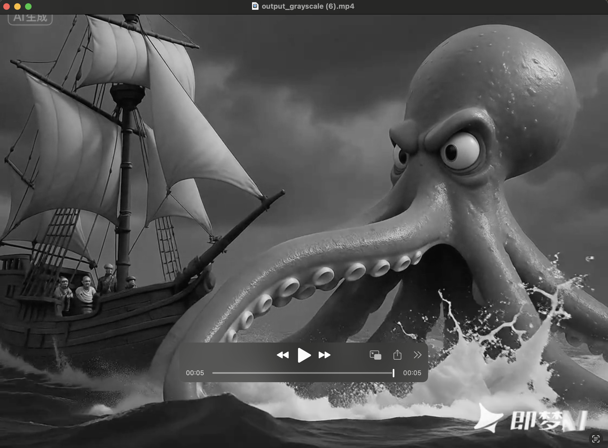

# WebGL 灰度滤镜与 FFmpeg.js 视频合成

一个基于 WebGL 和 FFmpeg.js 的浏览器端视频处理应用，可以将视频实时转换为灰度效果并重新合成输出。

## 效果展示

### 原始视频


### 处理界面


### 输出效果


## 功能特性

- 🎥 **视频上传**: 支持多种视频格式
- 🎨 **WebGL 灰度滤镜**: 使用 GPU 加速的实时灰度处理
- 🔄 **视频合成**: 使用 FFmpeg.js 将处理后的帧重新合成为视频
- 📱 **浏览器端处理**: 无需服务器，完全在浏览器中完成
- 💾 **自动下载**: 处理完成后自动下载结果视频

## 技术栈

- **WebGL**: GPU 加速的图像处理
- **FFmpeg.js**: 浏览器端视频编解码
- **Canvas API**: 帧数据提取和处理
- **JavaScript ES6+**: 现代 JavaScript 特性

## 项目结构

```
├── src/                    # 源代码目录
│   ├── index.html          # 主应用页面
│   └── js/
│       └── app.js          # 核心处理逻辑
├── docs/                   # 文档目录
│   ├── PRD.md              # 产品需求文档
│   └── TDD.md              # 技术设计文档
├── server.js               # Express 服务器
├── package.json            # 项目配置和依赖
├── .gitignore              # Git 忽略文件
└── README.md               # 项目说明
```

## 使用方法

### 方式一：使用 npm（推荐）

1. **安装依赖**
   ```bash
   npm install
   ```

2. **启动服务器**
   ```bash
   npm start
   ```

3. **访问应用**
   - 打开浏览器访问 `http://localhost:8000`

3. **处理视频**
   - 点击"选择文件"上传视频
   - 等待视频加载完成
   - 点击"开始灰度处理并合成视频"
   - 等待处理完成并自动下载结果

### 方式二：直接运行服务器

```bash
node server.js
```

然后访问 `http://localhost:8000`


## 处理限制

为了确保浏览器性能和稳定性：
- **视频时长**: 最多处理 10 秒
- **帧率**: 降低到 10fps 以减少处理时间
- **分辨率**: 保持原视频分辨率
- **格式**: 输出为 MP4 格式（H.264 编码）

## 开发过程中遇到的问题与解决方案

### 1. FFmpeg 未定义错误
**问题**: `Uncaught ReferenceError: FFmpeg is not defined`
**解决**: 更新 FFmpeg.js 版本并修正 API 调用方式

### 2. 跨域 Worker 错误
**问题**: `SecurityError: Failed to construct 'Worker'`
**解决**: 使用 HTTP 服务器而非直接打开文件

### 3. 中文乱码问题
**问题**: 按钮文字显示为乱码
**解决**: 添加 `<meta charset="UTF-8">` 声明

### 4. SharedArrayBuffer 不支持
**问题**: `SharedArrayBuffer is not defined`
**解决**: 创建自定义服务器设置必要的 HTTP 头部：
```javascript
res.setHeader('Cross-Origin-Opener-Policy', 'same-origin');
res.setHeader('Cross-Origin-Embedder-Policy', 'require-corp');
res.setHeader('Cross-Origin-Resource-Policy', 'cross-origin');
```

### 5. 输出文件不存在
**问题**: FFmpeg 处理失败但无错误提示
**解决**: 添加完整的错误处理和文件系统检查

### 6. 变量作用域错误
**问题**: `url is not defined`
**解决**: 调整变量作用域，将下载逻辑移入 try 块

### 7. 帧文件异步写入问题
**问题**: `Could not open file: frame00027.png`
**解决**: 正确处理 `canvas.toBlob()` 的异步特性，确保帧文件完全写入后再进行下一步

## 技术细节

### WebGL 着色器

**顶点着色器**: 定义渲染几何体
```glsl
attribute vec4 a_position;
attribute vec2 a_texCoord;
varying vec2 v_texCoord;
void main() {
    gl_Position = a_position;
    v_texCoord = a_texCoord;
}
```

**片段着色器**: 实现灰度转换
```glsl
precision mediump float;
uniform sampler2D u_image;
varying vec2 v_texCoord;
void main() {
    vec4 color = texture2D(u_image, v_texCoord);
    float gray = color.r * 0.299 + color.g * 0.587 + color.b * 0.114;
    gl_FragColor = vec4(gray, gray, gray, color.a);
}
```

### 处理流程

1. **视频加载**: 使用 HTML5 Video API
2. **帧提取**: 通过 `video.currentTime` 定位到特定时间点
3. **WebGL 处理**: 将视频帧作为纹理应用灰度着色器
4. **帧导出**: 使用 `canvas.toBlob()` 导出处理后的帧
5. **视频合成**: FFmpeg.js 将帧序列合成为视频

## 浏览器兼容性

- ✅ Chrome 88+
- ✅ Firefox 79+
- ✅ Safari 14+
- ✅ Edge 88+

需要支持：
- WebGL
- SharedArrayBuffer
- Canvas API
- File API

## 注意事项

1. **首次加载**: FFmpeg.js 首次加载需要下载约 20MB 的 WASM 文件
2. **内存使用**: 处理大视频时会占用较多内存
3. **处理时间**: 取决于视频长度和设备性能
4. **网络要求**: 需要网络连接以下载 FFmpeg 核心文件

## 许可证

Apache 2.0 License

## 贡献

欢迎提交 Issue 和 Pull Request！